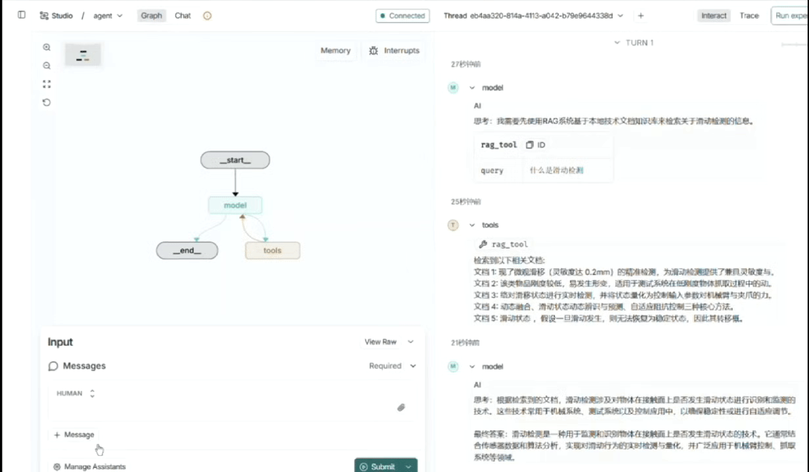

# Agent Learning Project

这是一个多个项目的集成项目，深度融合了RAG（检索增强生成）、网络搜索、任务规划执行（Manus）和MCP（模型协调协议）等多项前沿AI技术。项目能够在检索本地知识库的同时进行网络搜索，并通过任务规划执行框架自主完成复杂任务，所有这些都建立在MCP协议支持的丰富工具生态系统之上。通过API调用大语言模型进行推理，同时使用本地的bce-embedding-base_v1嵌入模型和Chroma向量数据库处理本地知识库检索，并采用ms-marco-MiniLM-L-6-v2交叉编码模型进行结果重排序。支持多角度查询和抽象查询等高级检索策略，提升检索准确性和回答质量。

## 项目教程

- [RAG实战教程博客](https://blog.csdn.net/weixin_44919384/article/details/154775920?spm=1001.2014.3001.5501)
- [Agent实战教程博客](https://blog.csdn.net/weixin_44919384/article/details/154985538?spm=1001.2014.3001.5501)

**执行说明**: 
- 启动langgraph服务时，必须在项目根目录（Agent_Learning）下执行`langgraph dev --port 2025`
- 单独执行RAG模块时，需要在src目录下通过`python RAG/rag.py`运行
- 执行前需要手动准备并指定模型文件路径

## 环境配置

1. 创建虚拟环境：
   ```bash
   uv venv
   ```

2. 激活虚拟环境：
   ```bash
   # Windows
   .venv\Scripts\activate
   
   # macOS/Linux
   source .venv/bin/activate
   ```

3. 安装依赖：
   ```bash
   uv pip install -r pyproject.toml
   ```

## 环境变量配置

项目需要配置以下环境变量，请为文件 `.env` 并填入相应值：

```bash
# Bingxing API 配置
BINGXING_API_KEY=your_bingxing_api_key_here
BINGXING_BASE_URL=your_bingxing_base_url_here

# ZhipuAI API 配置（可选）
ZHIPUAI_API_KEY=your_zhipuai_api_key_here

# DashScope API 配置（用于高德地图等服务）
DASHSCOPE_API_KEY=your_dashscope_api_key_here
```

注意：项目会自动从项目根目录下的 [.env](file:///E:/Agent_Learning/.env) 文件加载环境变量，包括PYTHONPATH。

## 使用方法

### 直接运行（推荐）

现在需要在特定目录下运行代码：

从目录Agent_Learning目录下运行：
```bash
langgraph dev --port 2025
```

单独执行RAG模块：
```bash
# 从src目录下执行
cd src
python RAG/rag.py
```

**注意**: 执行RAG模块时需要手动指定编码模型和embedding模型的本地路径


## 技术架构

### 核心组件

1. **Agent模块**
   - 智能代理实现
   - 工具集成和调用
   - RAG与网络搜索的智能路由
   
2. **RAG模块**
   - 文档切片处理
   - 向量检索
   - 重排序算法
   
3. **模型模块**
   - 大语言模型接口
   - 自定义模型适配

4. **工具模块**
   - 搜索工具
   - 数据处理工具
   - 文件操作工具

5. **MCP模块**
   - Model Coordination Protocol实现
   - 本地和远程工具服务集成
   - 支持时间查询、地图服务等功能

6. **Manus模块**
   - 基于LangGraph的多步骤任务执行框架
   - 计划制定、执行和报告生成
   - 支持复杂任务分解和自动化执行

### 技术栈

- Python 3.11+
- LangChain框架
- LangGraph工作流引擎
- OpenAI/GPT模型
- ZhipuAI大模型
- Chroma向量数据库
- FastAPI
- MCP (Model Coordination Protocol)

## 快速开始

### 1. 创建虚拟环境

```bash
# 克隆项目
git clone https://github.com/14680426/Agent_Learning.git
cd Agent_Learning

# 创建虚拟环境
uv venv

# 激活虚拟环境
# Windows:
.venv\Scripts\activate
# macOS/Linux:
# source .venv/bin/activate
```

### 2. 安装依赖

```bash
# 安装项目依赖
uv pip install -r pyproject.toml
```

### 3. 配置API密钥

创建 `.env` 文件并添加您的API密钥：

```env
BINGXING_API_KEY=your_bingxing_api_key_here
BINGXING_BASE_URL=your_bingxing_base_url_here
ZHIPUAI_API_KEY=your_zhipuai_api_key_here
DASHSCOPE_API_KEY=your_dashscope_api_key_here
```

### 4. 初始化环境

使用提供的脚本初始化环境变量：

Windows:
```cmd
init_env.cmd
```

或者PowerShell:
```
.\init_env.ps1
```

macOS/Linux:
```bash
chmod +x init_env.sh
./init_env.sh
```

### 5. 准备模型文件

在执行RAG或Agent之前，需要先准备好所需的模型文件。执行以下步骤：

```bash
# 从src目录下执行
cd src
python RAG/rag.py
```

执行过程中需要手动指定编码模型和embedding模型的本地路径。

**注意**: 程序不会自动下载模型文件，需要提前准备好相关模型文件并放在指定路径下。

### 6. 准备PDF文档

在项目目录中创建PDF文件夹并将您的PDF文件放入其中：

```bash
mkdir -p RAG/Dataset/PDF
# 将您的PDF文件放入 RAG/Dataset/PDF 目录中
```

### 7. 处理PDF文档

使用提供的脚本将PDF文档处理并存入向量数据库：

```bash
python src/RAG/tools/prepare_pdf_chunks.py
```

### 8. 运行项目

使用 langgraph 命令启动开发服务器：

```bash
# 从项目根目录执行
langgraph dev --port 2025
```

## 项目结构

```
src/
├── Agent/           # 智能代理核心实现，集成RAG与网络搜索
├── Manus/           # 基于LangGraph的多步骤任务执行框架
├── MCP/             # Model Coordination Protocol实现，提供工具服务
├── Models/          # 大语言模型接口与自定义模型适配
├── RAG/             # 检索增强生成系统
│   ├── Dataset/     # 本地知识库数据集
│   │   └── PDF/     # PDF文档存储目录
│   ├── tools/       # RAG专用工具（如文档处理）
│   └── rag.py       # RAG主程序入口
├── Tutorials/       # 教程、示例代码和学习资源
└── tools/           # 通用工具模块，供各组件共享使用
```

## 功能详解

### RAG功能
- 支持PDF、文本等多种格式文档处理
- 递归切片和语义切片
- 多种查询策略（单查询、多查询）
- 本地交叉编码器重排序

**注意**: RAG功能需要预先下载并指定编码模型和embedding模型的本地路径才能正常工作。

### 搜索功能
- 集成网络搜索能力
- 结果筛选和优化
- 与RAG结果融合

### Agent能力
- 自动选择合适的工具
- 多轮对话管理
- 结果整合和优化
- 智能决策RAG与网络搜索的使用时机

### MCP功能
- 支持本地MCP工具服务
- 集成远程MCP工具服务（时间查询、地图服务等）
- 提供统一的工具调用接口
- 扩展Agent和Manus的能力边界

详细信息请参阅 [MCP模块README](src/MCP/README.md)

### Manus功能
- 基于LangGraph的多步骤任务执行框架
- 支持任务计划制定、执行和报告生成
- 可处理复杂任务分解和自动化执行
- 集成多种工具（文件操作、shell命令、MCP工具等）

详细信息请参阅 [Manus模块README](src/Manus/README.md)

## 配置说明

在使用前需要配置以下环境变量：

```bash
OPENAI_API_KEY=your_openai_api_key
ZHIPUAI_API_KEY=your_zhipuai_api_key
```

## 许可证

本项目采用MIT许可证，详情请见[LICENSE](LICENSE)文件。

## 联系方式

如有问题或建议，请联系项目维护者。

---

## 调用RAG工具演示

