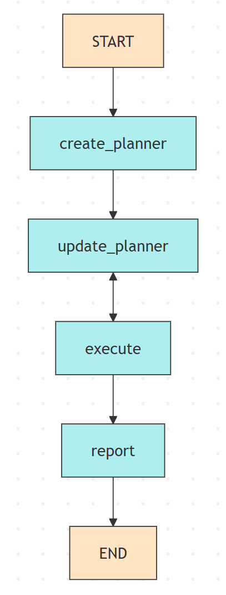
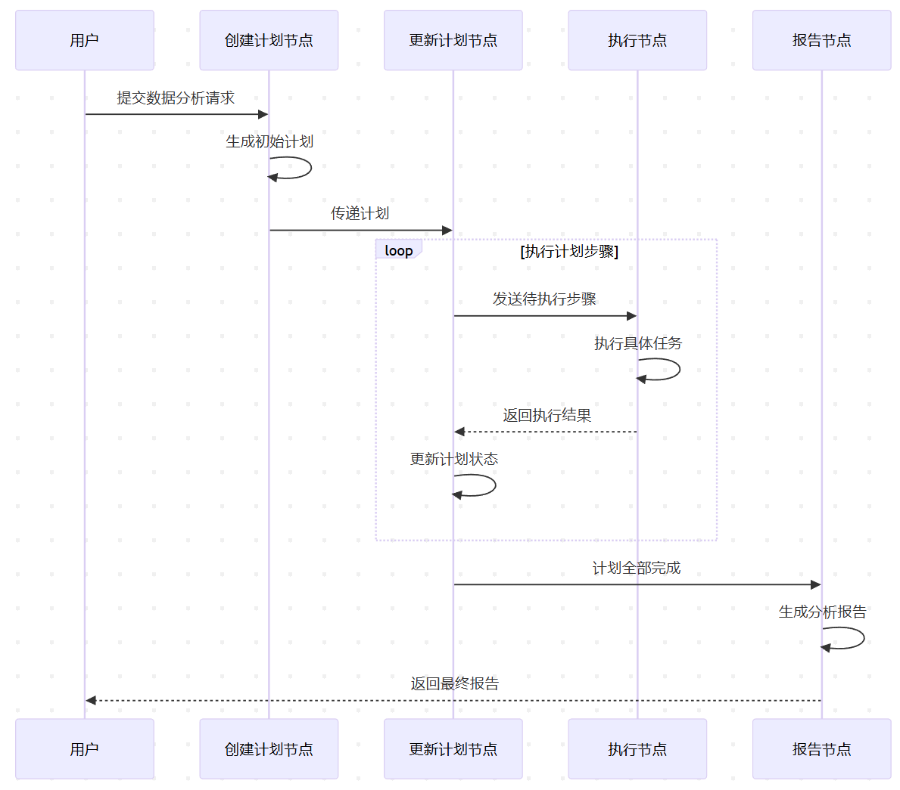

# Manus 项目

这是一个类似于Manus的端到端的智能agent, 它是基于 LangGraph 构建的自主规划和执行系统，专门用于数据分析任务。它能够根据用户需求自动生成执行计划，并逐步执行这些步骤来完成数据分析任务，支持本地工具调用和远程MCP工具服务。

## 项目概述

Manus 项目旨在创建一个智能代理，能够：
1. 根据用户需求自主规划任务步骤
2. 逐步执行计划中的各个步骤
3. 生成最终的数据分析报告

该项目展示了如何使用 LangGraph 构建复杂的 AI 代理工作流，包含计划、执行和报告等多个阶段。

## 系统架构

### 核心组件

1. **State（状态）**: 定义了代理的工作状态，包括用户消息、计划、观察结果和最终报告
2. **Nodes（节点）**: 包含四个核心处理节点
   - `create_planner_node`: 创建初始计划
   - `update_planner_node`: 根据执行结果更新计划
   - `execute_node`: 执行计划中的具体步骤
   - `report_node`: 生成最终报告
3. **Graph（图）**: 定义节点之间的连接关系和执行流程

### 工作流程



### 状态流转说明

1. **开始**: 流程从 START 节点开始
2. **创建计划**: 根据用户请求生成初步执行计划
3. **执行与更新**: 在 execute 和 update_planner 节点之间循环，直到所有步骤完成
4. **生成报告**: 所有步骤完成后，生成最终报告
5. **结束**: 流程结束

### 详细执行流程



## 主要功能

### 自主规划
- 根据用户请求自动生成详细的任务计划
- 计划包含具体的执行步骤和目标

### 动态执行
- 逐步骤执行计划中的任务
- 支持多种工具调用，如文件操作、代码执行等

### 智能更新
- 根据执行结果动态更新和完善计划
- 确保任务能够适应执行过程中的变化

### 报告生成
- 自动生成详细的任务执行报告
- 汇总所有执行结果和分析结论

## 工具集成

### 本地工具
Manus 集成了多种本地工具，可在执行阶段直接调用：

1. **文件操作工具**
   - `create_file`: 创建文件并写入内容
   - `str_replace`: 替换文件中的文本内容
   - `shell_exec`: 执行系统命令

2. **数据分析工具**
   - Python数据分析库（如pandas, matplotlib等）
   - 可视化生成工具

### 远程MCP工具
Manus 集成了基于MCP协议的远程工具服务，扩展了系统的功能边界：

1. **时间服务工具**
   - 获取精确的当前时间信息
   - 时间转换和计算功能

2. **地图服务工具**
   - 地理位置查询
   - 路线规划和导航
   - 地理编码服务

通过MCP协议，Manus可以无缝集成各种远程专业服务，在本地工具无法满足需求时提供强大的补充能力。

## 技术栈

- **LangGraph**: 构建代理工作流的核心框架
- **LangChain**: 处理语言模型交互和工具调用
- **Python**: 主要编程语言
- **Pandas**: 数据处理和分析
- **Matplotlib/Seaborn**: 数据可视化
- **MCP (Model Coordination Protocol)**: 远程工具集成协议

## 使用方法

1. 确保已安装所有依赖项
2. 准备需要分析的数据文件（如 CSV 文件）
3. 修改 [graph.py](file://e:\Agent_Learning\src\Manus\graph.py) 中的 `inputs` 变量，设置正确的用户消息和文件路径
4. 运行脚本：
   ```bash
   python graph.py
   ```

## 项目文件说明

- graph.py: 定义代理工作流图和执行入口
- state.py: 定义代理状态结构
- nodes.py: 实现各个处理节点的逻辑
- prompts.py: 包含所有使用的提示词模板
- student_habits_performance.csv: 示例数据文件
- log.txt: 程序执行日志文件

## 执行流程详解

### 1. 计划创建阶段
- 系统接收用户请求
- 调用大语言模型生成详细的执行计划
- 计划包含目标、思考过程和具体步骤

### 2. 计划执行阶段
- 系统逐个执行计划中的步骤
- 每个步骤可能涉及：
  - 文件操作
  - 代码执行
  - 数据分析
  - 可视化生成
  - MCP工具调用（时间查询、地理位置等）
- 执行结果被记录和观察

### 3. 计划更新阶段
- 根据执行结果更新和完善计划
- 标记已完成的步骤
- 调整后续步骤（如有必要）

### 4. 报告生成阶段
- 汇总所有执行结果
- 生成最终的数据分析报告
- 提供结论和建议

## 日志记录

系统会在执行过程中生成详细的日志记录，保存在 log.txt 文件中，便于调试和追踪执行过程。