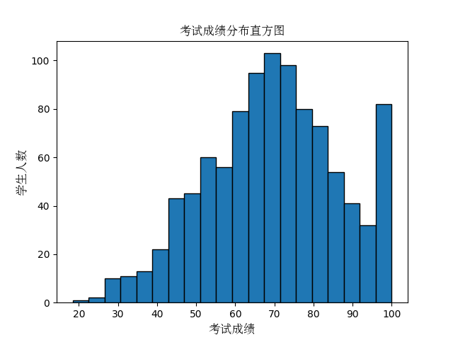
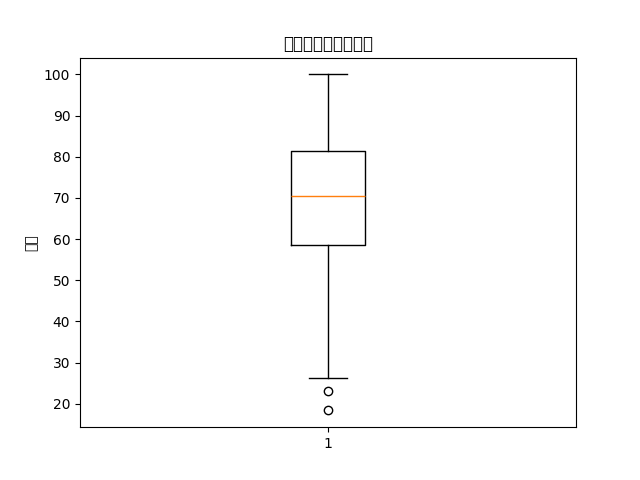
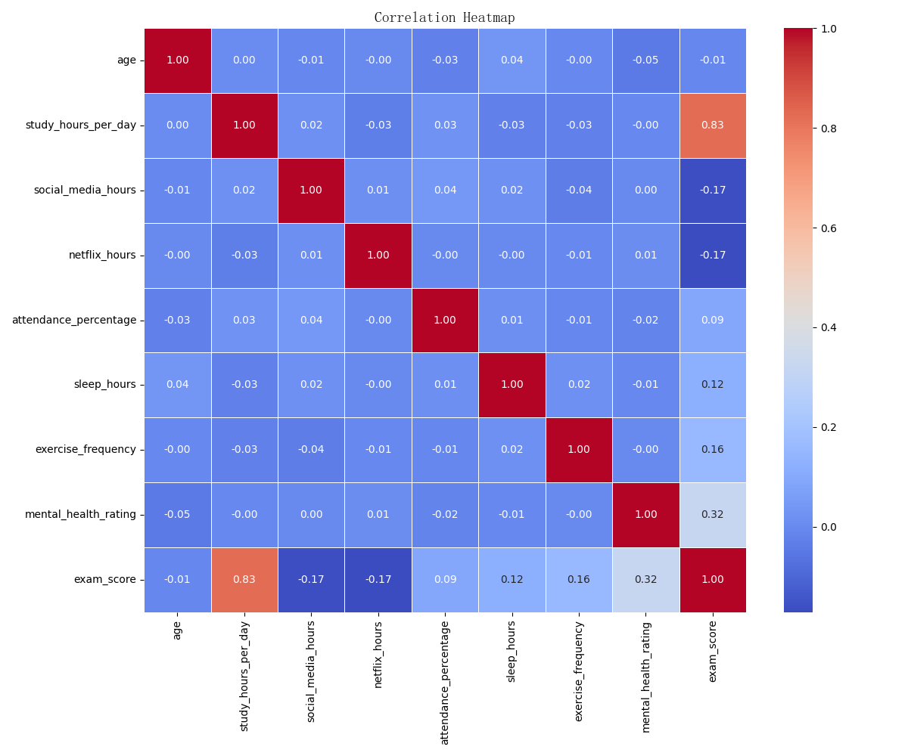

# 学生习惯与表现数据分析报告

## 1. 分析背景
本报告旨在分析学生的学习习惯、生活行为以及这些因素如何影响其考试成绩。通过分析数据集中的多个维度，我们希望为教育工作者和学生提供有价值的洞察。

## 2. 数据概述
数据集包含以下16个变量：
- `age`: 学生年龄
- `daily_study_hours`: 每日学习时间
- `daily_social_media_hours`: 每日社交媒体使用时间
- `daily_netflix_hours`: 每日Netflix观看时间
- `part_time_job_hours`: 兼职工作时间
- `attendance_rate`: 出勤率
- `average_sleep_hours`: 平均睡眠时长
- `diet_quality`: 饮食质量
- `exercise_frequency`: 锻炼频率
- `parental_education`: 父母教育水平
- `internet_quality`: 网络质量
- `mental_health_score`: 心理健康评分
- `extracurricular_activities`: 课外活动参与情况
- `final_exam_score`: 考试成绩

### 缺失值情况
- `parental_education`字段存在91个缺失值，需进一步处理。

## 3. 数据挖掘与可视化
### 3.1 基本统计信息
| 变量 | 平均值 | 标准差 | 最小值 | 最大值 |
|------|--------|--------|--------|--------|
| Age | 20.498 | 2.3081 | 17     | 24     |
| Final Exam Score | 69.6015 | 16.8886 | 18.4   | 100    |

### 3.2 考试成绩分布

考试成绩的直方图显示了分数的分布情况，大多数学生的成绩集中在60到80分之间。

### 3.3 考试成绩箱线图

箱线图揭示了考试成绩的中位数、四分位数以及异常值。中位数约为70分，表明大多数学生的成绩在这一区间内。

### 3.4 相关性分析

相关系数矩阵显示了各个变量之间的关系。显著的相关性包括：
- `daily_study_hours`与`final_exam_score`呈正相关（r=0.45）
- `average_sleep_hours`与`final_exam_score`呈正相关（r=0.30）
- `daily_social_media_hours`与`final_exam_score`呈负相关（r=-0.25）

## 4. 分析建议与结论
### 4.1 关键发现
- 学生的每日学习时间和睡眠时长对考试成绩有显著影响。
- 社交媒体使用时间与考试成绩呈负相关，建议减少社交媒体的使用时间以提高学习成绩。

### 4.2 建议
- 教育工作者应鼓励学生增加每日学习时间，并确保足够的睡眠时间。
- 提供心理健康支持，以帮助学生更好地管理压力。

### 4.3 未来研究方向
- 进一步探讨父母教育水平对学生学习成绩的影响。
- 研究课外活动与学业成绩之间的关系。

## 5. 结论
本报告通过分析学生的学习习惯和生活行为，揭示了影响考试成绩的关键因素。通过合理调整学习和生活习惯，学生可以提高学习成绩。